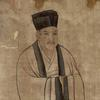

# 巨大困惑，为何像秦桧这种掌握权力的高层会卖国求荣？

编程等 2 个话题下的优秀答主

已关注

203 人赞同了该回答

[发布于 2023-07-25 01:16](https://www.zhihu.com/question/583198416/answer/3133751342)・IP 属地广东

想要回答这个问题，你起码要对中国古代文人的知识水平有一个起码的了解。

> 唐朝科举考试有秀才、[明经](https://baike.baidu.com/item/%E6%98%8E%E7%BB%8F/2261315?fromModule=lemma_inlink)、俊士、进士、[明法](https://baike.baidu.com/item/%E6%98%8E%E6%B3%95/8097085?fromModule=lemma_inlink)（法律）、明字、明算（数学）等多种科目，考试内容有时务策、帖经、杂文等。\[6\]\[8\]宋朝科举考试有进士、明经科目，考试内容有帖经、[墨义](https://baike.baidu.com/item/%E5%A2%A8%E4%B9%89/2250440?fromModule=lemma_inlink)和诗赋，[王安石](https://baike.baidu.com/item/%E7%8E%8B%E5%AE%89%E7%9F%B3/127359?fromModule=lemma_inlink)任参知政事后，取消诗赋、帖经、墨义，专以经义、论、策取士。明清科举改为考[八股文](https://baike.baidu.com/item/%E5%85%AB%E8%82%A1%E6%96%87/244756?fromModule=lemma_inlink)。\[9-10\]

  

> 科举的演进，是从内容到形式对读书人的思想限制越来越严。北宋王安石废诗赋取经义，将取士[内容限制](https://baike.baidu.com/item/%E5%86%85%E5%AE%B9%E9%99%90%E5%88%B6/22311121?fromModule=lemma_inlink)到儒家经典的狭窄范围内。南宋时经义形成“有定格律，首有破题，破题之下有接题”，然后有小讲、大讲、余意、结尾等固定段落，“篇篇按此次序，其文多拘于偶对，大抵冗长繁复，可厌”。 \[56\] 可见南宋经义已具八股雏形了。 \[55\]  
> 明朝中叶，形成八股文。八股文每篇由破题、承题、起讲、入手、起股、中股、后股、束股等固定段落组成。八股文不仅体制僵死，而且要“代圣贤立言”，即揣摩圣人孔、孟和贤人程、朱的语气说话，因而八股文多半含混生涩、似通非通。八股文没有诗、赋、论、策等文体的佳作那种熠熠文采和酣畅气势，而是晦涩枯燥，有些词句甚至难于准确把握其意义。典型的[八股文风](https://baike.baidu.com/item/%E5%85%AB%E8%82%A1%E6%96%87%E9%A3%8E/22928745?fromModule=lemma_inlink)是啰啰嗦嗦，空疏无聊，同政治才能谈不上有什么关系。明清统治者标榜“求实尚正”，只许考生做“浑厚老成”的死板文章，不得用诗赋式的华丽词藻，不得引用经典以外的其它任何书籍。八股文没有诗赋策论那种旁征博引、譬喻联翩的绚丽色彩，也不可有其它任何越出界限之处。甚至即使在经典之内，还有犯上、犯下的禁忌。例如《论语》中“止[子路](https://baike.baidu.com/item/%E5%AD%90%E8%B7%AF/1317216?fromModule=lemma_inlink)宿，杀鸡为黍而食之，见其二子焉。”倘考官出题“杀鸡为黍而食之”，则考生文章如果涉及“止子路宿”，就是犯上，涉及“见其二子焉” \[87\] ，就是犯下，都不许可。要在如此严格僵死的规矩中将孔孟经书的只言片语敷衍拉扯成一篇文章，的确是件极难的事情。 \[55\]  
> 自王安石推行经义取士之后，科举制度的积极性日少、消极性日增，至明清两代，科举达于极盛而自身的弊病亦达于极甚。在一个专制、封闭的[社会环境](https://baike.baidu.com/item/%E7%A4%BE%E4%BC%9A%E7%8E%AF%E5%A2%83/2987845?fromModule=lemma_inlink)中，由于无法接受新的思想、学术、技术的影响，没有革新精神，一种既存制度或事物的演变过程常常不是越变越好，而是越变越糟。 \[55\]

* * *

看得懂引文的意思吗？

  

唐朝初设科举，明算（数学）还是考试科目之一；但宋朝已经不再承认“明算”了；到了王安石变法，连词赋、墨义都不再考了！

  

换句话说，大宋时代起，**读书人哪怕殿试拿第一，理论上他都是可以不会加减乘除四则运算的**！

很震撼吧？哈哈。

  

没错，哪怕大清时期，也不可能有哪个读书人不会四则运算的——但，切记，四则运算是杂学，奇技淫巧之一，是读书不成、可以退而去当帐房先生的后路、杂艺！

我也是小时候跟着爷爷学打算盘，才知道过去考科举，私塾先生竟然是不教算盘的；我爷爷自己好学，这才找村子里的帐房先生学会了打算盘。

* * *

好了，现在让我们给宋朝那些高官来一张画像：

*   他们从小苦读四书五经
*   个别好杂学的跟着帐房先生学过打算盘，会基本的四则运算
*   除此之外，他们没有掌握任何知识
*   无论是政治学、心理学还是其它，他们都**可以**一无所知

  

嗯……说的夸张点：

*   小学四年级的数学水平
*   背过一堆弟子规
*   会写八股文
*   如果此人有心学别的，可能会学到一堆书法绘画诗词歌赋方面的技艺；

*   倘无心，什么都不会也没关系

好了，现在假如你们公司空降了这么一位高管，你觉得他会搞点什么？他能带着你做点什么？

* * *

这就是宋朝的状况。

它的朝堂之上充斥着数理逻辑方面的知识水平搁现在至多混混四年级的“饱学大儒”；这些大儒和现在的键盘侠一样——哦，还不如键盘侠，起码键盘侠还是知道点直线曲线抛物线三角函数的——嘴皮子非常厉害。

  

别的？

没了。

没了？

没了！

  

好了。现在你召集一批小学四年级水平的文盲，搞一个理论研修班，试图统治几千万人——你觉得你会得到什么？

* * *

其实，宋代以来的历史早已展示给我们了——这些人，除了党争内行，别的什么都不会。

用脚趾头想也明白：就这么一批连算盘都打不好的文学家——后来连文学都不准他们学，一心键政——那当然只能当没有键盘的键盘侠……哦，不对，只能当算盘打的并不熟练的算盘侠了。

  

当这些算盘都打不熟的算盘侠胡扯什么天下大势时，他们知道y=x^2和y=x \* logx这两个大势有什么差别吗？

至于什么y=sin(x)、x^2+y^2=1这么“高深”的数学……您还是千万别难他们了。

四年级的数学水平，并不能支撑他们做出任何有效判断。

  

这种能力，别说管理一个千万人口的大国了——这就是跑去管一个千把口人的大村子，智商也欠费啊。

* * *

总之，谈论帝王将相时，第一就是要给他们驱魅。

千万别一听什么千古一帝、什么内政外交，你就膝盖发软就想给他们跪下。

  

起来！别跪！

  

这些人就是一群小学四年级辍学生。他们的智商可能比我们高；但再高也就那样了。

小学四年级的知识水平，无法支持他们的贪婪和欲望。

  

这第一就体现在，他们只能基于贪污治国——小学四年级的数学水平，一村的帐都算不平，凭什么算天下的帐？知道什么叫统计学、什么叫方差标准差吗？

第二体现在，他们做的任何事，无论成败，都拿不出一个客观、理性、严谨的说法；兜兜转转，最终都落在“忠奸”“清廉”这些空泛的大词上——而且哪怕这种模棱两可的大词，最终也是当大帽子扣在政敌头上：这一套一套的说辞，连他们自己都不信！

第三则体现在，他们连他们自己的短期利益都算不对——更别说长期利益了。

  

举例来说，大清末年，战败赔款拿不出来——拿不出来怎么办？再苦一苦百姓？

英国人给拦住了：我替你守若干年海关，每年扣除多少所得作为赔偿，剩下给你。

慈禧懵了：海关？那个清水衙门？英国人咋恁傻呢？要这么个没油水的清水衙门干什么？给他给他！剩下？哪剩的下！

结果，英国这么一守海关，别说战争赔款了，就连大清国库都被每年“剩下”的银子填的满满的——这才导致太平天国起义失败。

  

为什么有这么大差别？

因为，你找一帮子小学四年级文化程度的半文盲，他们是这样看的：

*   商人不老实，嘴里没实话
*   谁知道他能赚多少
*   逼他！只要他肯给，那就肯定还有油水！
*   耗他！耗到他急了，自然拿钱来孝敬！
*   逼着、耗着，商人没了
*   清水衙门！倒了八辈子血霉才到这种地方！
*   门可罗雀，稀稀拉拉没几个商人
*   敢来的商人，要么惹不起；要么要钱没有，要命一条！
*   穷！

但，你换一群国际贸易专业的本科生、研究生，他们是这样看的：

*   任何贸易都有利润
*   我们（海关）无需把利润吃干，否则人家没赚头就不贸易了
*   贸易最重要的是稳定，收益可预期

*   因此，税率要公示，然后严格按照税率征收
*   商人自己会根据税率，寻找有利可图的商品
*   贸易种类越多、来往客商越多，可以收到的税金就越多

*   可以根据每月过关商品总量、分类统计
*   根据商品总量以及增量，就可以知道哪些商品利润大、销路广
*   通过调整税率，影响商品流通量
*   根据税率对流通量的影响，可以归纳出每一类贸易的不同特点

*   分析哪些商品是高风险的暴利奢侈品、哪些是低风险的薄利多销产品
*   根据商品类别，制定更合理的税率

  

结果，这一科学征税：

第一，贸易繁荣了，因为风险稳定可控，商人们敢于来回过关，不怕被人逼死、耗死；

第二，海关是随着贸易按比例抽税的；贸易繁荣，海关收入就高

于是，英国不光拿到了巨额战争赔款，反而在同时繁荣了大清经济、充实了大清国库。

  

你看，这大学生，和四年级学生，是不一样吧？

* * *

好了，当我们明白，赵构、秦桧等封建帝国的高层不过是一些四年级水平的半文盲时，事情就顺理成章了。

  

比如，赵佶，这是一位很好的诗人、书法家、画家、园林艺术家——这是他超越众人之处。

然后？

套模板就好了：

*   小学四年级的理科水平
*   没了

  

然后，赵构，这位更惨：

*   不是预定的接班人，所以没培养基本的待人接物方面的修养
*   小学二年级的理科水平
*   看着都城无人守卫，最后靠神仙（跳大神的）迎战，失败
*   爹赵佶被抓走了，哥哥赵恒被抓走了
*   妈、媳妇儿还有妹妹们被折算成银子，赔给金人当性奴
*   国破家亡
*   被金兵打进南宋疆域，搜山检海，把他当王八抓
*   赵构从此阳痿
*   幸好没抓到，逃海上逃过一命

这位从此患上了恐金症——用现在的话说，习得性无助，彻底奴化了。

听到金人传来的任何消息，他先跪、先尿裤子，然后……照做。

  

然后，终于轮到秦桧了：

> 《宋史》卷475：时雍先署状，以率百官。御史中丞秦桧不书，抗言请立赵氏宗室，且言邦昌当上皇时，专事宴游，党附权奸，蠹国乱政，社稷倾危实由邦昌。金人怒，执桧。

*   最初，开封陷落时，他很有勇气，勇敢的反抗金人，被金人掳至北国
*   这一路上，秦桧亲眼看着皇后、皇太后、帝姬（公主）以及诰命夫人等如何辱于金人营中
*   徽钦二宗苟且偷生、摇尾乞怜的丑态震撼了这个四年级小学生
*   小学生三观被颠覆了；很快，小学生被金人驯化，成了忠心的奴才
*   回国

> 宋高宗建炎元年（1127年）四月，金军驱掳宋徽宗赵佶、宋钦宗赵桓北上，把[张叔夜](https://baike.baidu.com/item/%E5%BC%A0%E5%8F%94%E5%A4%9C/1479919?fromModule=lemma_inlink)、[何栗](https://baike.baidu.com/item/%E4%BD%95%E6%A0%97/9832168?fromModule=lemma_inlink)、[孙傅](https://baike.baidu.com/item/%E5%AD%99%E5%82%85/7990349?fromModule=lemma_inlink)、秦桧、[司马朴](https://baike.baidu.com/item/%E5%8F%B8%E9%A9%AC%E6%9C%B4/3789202?fromModule=lemma_inlink)、[陈过庭](https://baike.baidu.com/item/%E9%99%88%E8%BF%87%E5%BA%AD/541162?fromModule=lemma_inlink)等都一并押走。到达北方后，孙傅等人都守节不屈，唯独秦桧屈服于威逼利诱，见风转舵。宋徽宗赵佶得到宋高宗即位的消息，叫秦桧起草一封信，向金酋[粘罕](https://baike.baidu.com/item/%E7%B2%98%E7%BD%95/1482102?fromModule=lemma_inlink)摇尾乞怜，表示愿派人通知儿子[赵构](https://baike.baidu.com/item/%E8%B5%B5%E6%9E%84/618917?fromModule=lemma_inlink)，愿意子子孙孙永远奉金正朔，并向金纳贡。后来，秦桧对此事并不完全隐瞒，还进行自我吹嘘。\[24\]宋徽宗的一纸卖身契，并未使他超脱阶下囚的困境。而秦桧却开始饱享女真贵族的残羹剩炙，粘罕非常赏识秦桧，赐给他钱万贯、绢万匹。\[25\]据说，秦桧通过“厚赂”，打通关节，此信才得以传送到粘罕手中。

  

回国之后，稀里糊涂的，赵构相信了这个来历不明的秦桧——没人知道他是怎么携家带口从金地跑回来的。

> 《宋史》卷473：桧之归也，自言杀金人监己者奔舟而来。朝士多谓桧与樐、傅、朴同拘，而桧独归；又自燕至楚二千八百里，逾河越海，岂无讥诃之者，安得杀监而南？就令从军挞懒，金人纵之，必质妻属，安得与王氏偕？惟宰相范宗尹、同知枢密院李回与桧善，尽破群疑，力荐其忠。

  

为什么秦桧会卖国？

你看这个组合：被金兵吓痿了的皇帝，配早就学会了向金国摇尾乞怜的宰相——你觉得他们在金国面前硬气的起来吗？

脊梁早被打断了！

  

然后呢，大宋历来是以文制武，武将地位极低；尤其低级官兵，那是直接脸上刺字，让他当不了逃兵——比如大将狄青，靠军功当了大将军，脸上还有刺字；之后被文人集团排挤，郁郁而死。

同时，我们知道，大宋官民利益是尖锐对立的：

> 彦博又言：“祖宗法制具在，不须更张以失人心。”  
> 上曰：“更张法制，于士大夫诚多不悦，然于百姓何所不便？”  
> 彦博曰：“为与士大夫治天下，非与百姓治天下也。”

  

看到了吗？

大宋小朝廷眼里，“士”，也就是那一干小学四年级水平的文人，这是自己人；而其他人，包括以血肉为长城的军人、养活了他们这一窝子蛀虫的农民、工匠、商人，统统是防范对象。

  

换句话说，在赵构眼里，秦桧是自己人；在秦桧眼里，赵构以及部分文人也是自己人。

注意，在赵构眼里，可以说朝堂上绝大多数文人都是“自己人”，只有个别不服管的不是；这和秦桧是不一样的——前面提过，北宋神宗以来，朝堂党争严重，键盘侠……哦不，算盘侠们分成两党殊死搏斗，斗争越来越尖锐；这种党争同样延续到了南宋。

然后，军方弹压不住了，这才使得南宋将星璀璨——但这些会打仗的人，在赵构看来是“与虎谋皮”：需要他们来抗衡金国，别让金人动不动“搜山检海”，九姑娘实在是怕了……

但归根结底，军人，将领，这些都不是自己人。

  

再换句话说：

*   金人是不可撼动的真老虎，必须和谈、稳住，必要时可以出卖国家利益
*   武人是对抗金人的奴隶，要想办法奴役他们，但须防其坐大
*   平民也是奴隶，需要武人镇压
*   要奴役这些奴隶，就必须和秦桧等文臣合作

所以：

*   金人是不可触怒的
*   杀几个武人而已，杀奴隶换来金人宽恕，对奴隶主来说当然是很合算的
*   付出其它东西，包括国土、人民、财帛，换金人开心，对奴隶主来说都是合算的
*   一切的一切，都比不上奴隶主群体的利益

*   奴隶主群体有谁？
*   赵构，秦桧，以及一干文臣

*   党同伐异四字而已

  

你看，小学四年级水平的脑回路，是不是很让人无力吐槽？

你不可能让他们明白，人民、军人，才是国家的存在基础，才是国家的根。

这不可能。

  

这就好像……大家都四年级水平，那是一张嘴，哎呀，你吐一个词，我就懂了您的雅意！

你看，铁自己人，对吧？

其他任何人，一张嘴神神秘秘的，什么地势什么士气什么山川地理补给水源；或者什么土地肥力墒情瑞雪春雨；什么利率利润本钱盈余……你觉得这是自己人吗？

  

对，没错。这就是信息茧房。

**他们主动把自己囚禁在信息茧房里，与天下为敌**。

除了朝堂上那么一小撮四年级数学水平的文人，整个天下都是他们（潜在）的敌人——虽然农工商兵都仰慕他们、向他们靠拢、从来没觉得他们是外人；但他们自己认为除了他们的小团体，其它一切都是敌人。

  

他们认为的国，和岳飞韩世忠辛弃疾、以及黎民百姓、以及后世的我们头脑中的国，并不是一个国。

在赵构秦桧看来，“国”很小，只有赵构一个人是国，赵构家人等国的附属物也是国，秦桧等“士”是国的外围——那么卖掉岳飞、卖掉一些城池、卖掉一些百姓……甚至，卖掉自己的妈自己的媳妇儿妹妹给金兵玩，这都不算卖国。

——不卖皇帝就没卖国。

  

这一套，赵构、秦桧，加上赵佶，算是开创者；但因为皇帝=国深入人心，所以后世只敢把骂名扣在秦桧头上。

而且，后来的明清是完全一样的，甚至是变本加厉的：他们一如既往的盘剥百姓、大搞愚民政策，硬生生割断了中华民族的筋骨、切断了中华民族的神经，使得偌大的国家在少量外敌面前瞬间土崩瓦解，没有半点韧性。

这些人，其实就是另外的一些秦桧——一些小学四年级智商水平的、极度狭隘的村炮。

狭隘到，除了他们这些主动缠了自己的脑袋、除了四书五经八股文，连算盘都不用学的傻逼团体之外，一切人都是他们的敌人。

[发布于 2023-07-25 01:16](https://www.zhihu.com/question/583198416/answer/3133751342)・IP 属地广东

真诚赞赏，手留余香

赞赏

还没有人赞赏，快来当第一个赞赏的人吧！

​已赞同 203​​47 条评论

​分享

​收藏​喜欢

​

收起​
